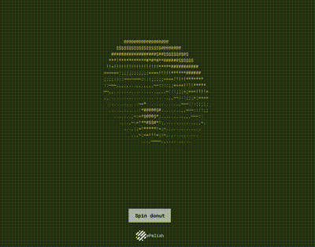

# Spinning Donut

This project is a JavaScript implementation of a spinning donut, rendered in text using HTML and CSS. The animation creates the illusion of a 3D spinning donut using simple trigonometric functions.

## Table of Contents

- [Demo](#demo)
- [Features](#features)
- [Installation](#installation)
- [Usage](#usage)
- [How It Works](#how-it-works)
- [Algorithm Documentation](#algorithm-documentation)
- [License](#license)

## Demo

Open `index.html` in your browser to see the spinning donut in action. Click the "Toggle Animation" button to start or stop the animation.

## Features

- Spinning donut animation rendered in text
- Toggle animation on and off with a button
- Simple and lightweight implementation

## Installation

1. **Clone the repository:**
   ```sh
   git clone https://github.com/peliah/spinning-donut.git

2. **Navigate to the project directory**
   ```sh
   cd spinning-donut

2. **Open index.html in your web browser:**

### Toggle Animation

Click the "Toggle Animation" button to start or stop the donut animation.

## How It Works

The spinning donut is rendered using ASCII characters in a `<pre>` tag to maintain the text formatting. The animation is created using trigonometric functions to simulate 3D rotation. The script updates the characters in the `<pre>` tag at regular intervals to create the spinning effect.

## Example



## Algorithm Documentation

The algorithm behind the spinning donut involves using a rotation matrix to perform 3D rotations and project the 3D coordinates onto a 2D plane.

### Original Creator

The concept of the spinning donut was popularized by Andy Sloane. You can find the original implementation and detailed explanation on his [website](https://www.a1k0n.net/2011/07/20/donut-math.htmls).

### Rotation Matrix and 3D Projection

The algorithm uses trigonometric functions to compute the rotation of the donut in 3D space. Here are some useful resources for understanding the mathematics behind 3D rotations and projections:

- 3D Rotation Matrices:
  - [Khan Academy - Rotations in 3D](https://www.khanacademy.org/math/linear-algebra/matrix-transformations#lin-alg-matrix-transform)
  - [Wikipedia - Rotation Matrix](https://en.wikipedia.org/wiki/Rotation_matrix)
- 3D Projection:
  - [Wikipedia - 3D Projection](https://en.wikipedia.org/wiki/3D_projection)
  - [Mathematical Foundations of 3D Projection](https://www.scratchapixel.com/lessons/3d-basic-rendering/perspective-and-orthographic-projection-matrix/orthographic-projection)
  
### Trigonometric Functions

The animation relies heavily on sine and cosine functions to compute the rotations. Here are some resources on trigonometric functions:

- [Khan Academy - Trigonometry](https://www.khanacademy.org/math/trigonometry)
- [Wikipedia - Trigonometric Functions](https://en.wikipedia.org/wiki/Trigonometric_functions)

By studying these resources, you can gain a deeper understanding of the mathematical principles used to create the spinning donut animation.

## License

This project is licensed under the [MIT License](LICENSE).
